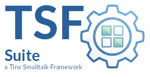

|[](https://pharo.org)|[](./LICENSE) [](#)|
|----|----|
|| ***TSF-nexutils***<br>Modular, reusable Smalltalk utilities and libraries for Pharo applications and services |

<sup>***TSF*** stands for ***Tiny Smalltalk Framework*** — minimalistic tools for robust applications</sup>

---

## Overview

NexUtils is a collection of small, focused, reusable components for Pharo applications and services. Its modules provide common building blocks for logging, JSON-RPC, peer-to-peer communication, and other application infrastructure.


---

## Components

* [NexUtils-Core](readme-core.md)
Basic, reusable utilities. Currently contains:
    * **NexLockFile** — file-based locking for coordinating access between processes. The component is designed to be useful independently and is not tied to the other NexUtils packages.

* [NexUtils-Logging](readme-logger.md)
A lightweight logging framework for Pharo applications. NexUtils-Logging uses `NexLockFile` where file-based synchronization is required.

* [NexUtils-P2P](readme-p2p.md)
Peer-to-peer communication infrastructure for Pharo applications.

---

## Tests

The components have corresponding test packages:

* `NexUtils-Core-Tests`
* `NexUtils-Logging-Tests`
* `NexUtils-P2P-Tests`

Core component tests are currently part of the corresponding component's development.

---

## Installation

NexUtils packages are managed as standard Pharo packages. The repository can be loaded into a Pharo image using Metacello / Iceberg.
See the individual component README files for component-specific installation and usage information.

Load the whole NexUtils project using Metacello. This will automatically fetch all necessary dependencies.

```smalltalk
Metacello new 
	baseline: 'NexUtils'; 
	repository: 'codeberg.org/tiny-frameworks/nexutils-st/src';
	onWarning: [ :warning | 
		(warning isKindOf: MCMergeOrLoadWarning) 
		ifTrue: [ warning load ] ifFalse: [ warning resume ] 
	]; 
	load.
```

---

## Repository Structure

```text
NexUtils
├── src
│   ├── NexUtils-Core
│   ├── NexUtils-Logging
│   ├── NexUtils-Logging-Tests
│   ├── NexUtils-P2P
│   └── NexUtils-P2P-Tests
│
├── readme.md
├── readme-lockfile.md
├── readme-logger.md
└── readme-p2p.md
```

---

## Organizational & Standards

* **Copyright:** © 2026 Georg Hagn.
* **Repository:** `codeberg.org/tiny-frameworks/nexutils-st`
* **License:** Apache License, Version 2.0.

*TSF-nexutils is an independent open-source project and is not affiliated with any corporation of a similar name.*

---

## Contact & Support

For inquiries, architectural discussions, or security issues, please contact:

📧 **georghagn [at] tiny-frameworks.io**

---

